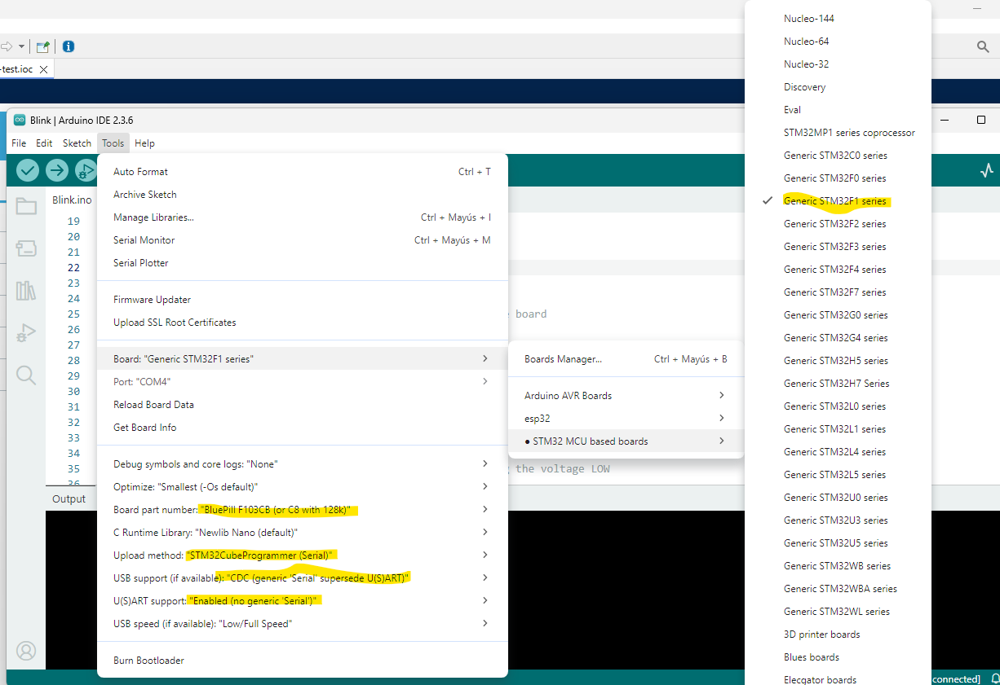
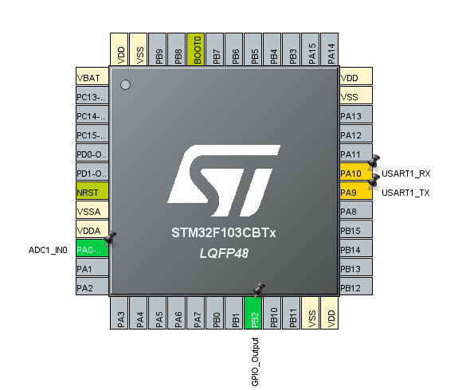
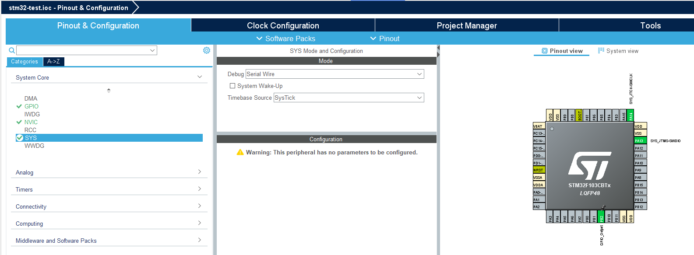
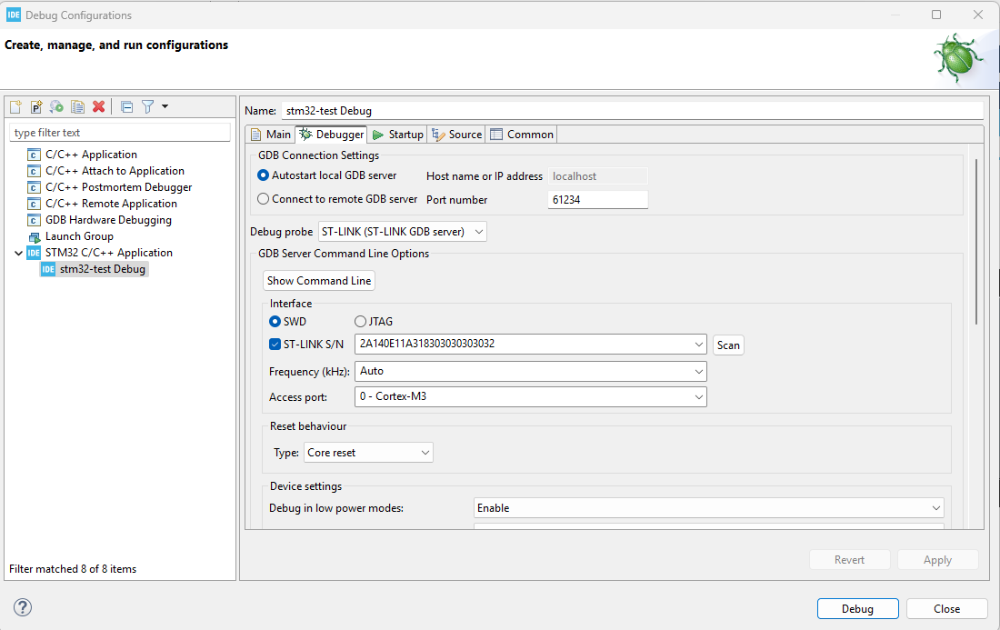

# How to setup
## UART
To enter in the boot mode:
- press and keep boot button
- press reset button and wait a couple of seconds
- release reset button and wait 1 second
- release boot button

### How to burn bootloader with Arduino ide
***Important!***

### STM32CUBE IDE pinout

The ADC1_IN0 was used only for a sample. It's not needed. Configure inputs/outputs as required for the code.
The important part is setting PA10 to USART1_RX and PA9 toUSART1_TX
### WIRING
- UART TX -> BOARD RX (PA9)
- UART RX -> BOARD TX (PA10)
- UART GND -> BOARD GND
- VCC connected if not using external power for the board, like usb...
## ST-Link v2
### STM32CUBE IDE pinout

Under pinout & configuration set the SYS Debug to `Serial Wire`. This will automatically update the PA13 and PA14 to be SWDIO and SWCLK.

### WIRING
Match SWDIO, SWCLK and GND. Use 3v3 if the board is not connected to external power.

### Debug config

***Important! Set the reset behaviour to Core reset.***